## Description

This application demonstrates I2C communication between the MAX32690FTHR and an ADXL343 Digital MEMS Accelerometer.

The application...
- Configures the I2C peripheral instance
- Probes the I2C bus for an ADXL343
- Configures the ADXL343
- Waits for console input
- Enters low power mode

The ADXL343 is configured to enable Data Ready interrupts on pin INT2.  The INT2 signal is used as an external interrupt source capable of waking the MAX32690 from sleep mode.  Acceleration data is printed to the console UART on each interrupt.

#### Required Connections:

Open a terminal application on the PC and connect to the MAX32690 console UART at 115200, 8-N-1 settings. You can use TeraTerm or the VS Code Serial Monitor for this!

> [!IMPORTANT]
> - Run **Visual Studio Code** from desktop icon
> - From the menu bar, click **Terminal->New Terminal**
> - From the terminal window at the bottom right, select **SERIAL MONITOR**, match the settings in the image below, and click **Start Monitoring**

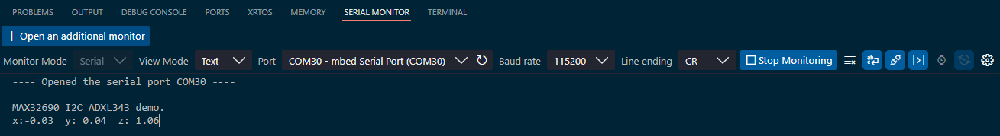

#### Expected Output

The console UART of the MAX32690FTHR will output these messages, along with real-time accelerometer data:
```
MAX32690 I2C ADXL343 demo.
Press Enter/Return to continue ...
x:-0.02  y: 0.02  z: 0.99
```

#### Hardware Setup

**Components:**

- [Adafruit ADXL343 + ADT7410 Sensor FeatherWing](https://www.adafruit.com/product/4147#:~:text=Upgrade%20any%20Feather%20board%20with%20motion%20and%20precision%20temperature%20sensing)
- [Adafruit FeatherWing Doubler](https://www.digikey.com/en/products/detail/adafruit-industries-llc/2890/5777188?utm_adgroup=&utm_source=google&utm_medium=cpc&utm_campaign=PMax%20Shopping_Product_Low%20ROAS%20Categories&utm_term=&utm_content=&utm_id=go_cmp-20243063506_adg-_ad-__dev-m_ext-_prd-5777188_sig-Cj0KCQjwmOm3BhC8ARIsAOSbapXWc4QrPu9hvkGExHfYoowCYfo_lowEmtW7IHq_iZKP1zqqN4wc5hwaAoHeEALw_wcB&gad_source=1&gbraid=0AAAAADrbLliM7VDd0sPDN1aF2isaVwkF7&gclid=Cj0KCQjwmOm3BhC8ARIsAOSbapXWc4QrPu9hvkGExHfYoowCYfo_lowEmtW7IHq_iZKP1zqqN4wc5hwaAoHeEALw_wcB)
- [MAX32690FTHR Microcontroller Eval Platform](https://www.analog.com/en/products/max32690.html)

```
                                                                    USB
                                                                     │
                                                                     ▼
┌───────────────────────────┐                  ┌───────────────────────────┐
│ Sensor FeatherWing        │                  │ MAX32690FTHR              │
│                           │                  │                           │
│                           │                  │                           │
│                       VDD │◄─────────────────┤ +3.3V               P0.14 ├─────►(Red LED)
│                           │                  │                           │
│                           │                  │                     P2.24 ├─────►(Green LED)
│                           │                  │                           │
│                           │                  │                     P2.25 ├─────►(Blue LED)
│               ADXL343_SDA ├──────────────────┤ P2.7 (I2C0_SDA)           │
│                           │                  │                           │                USB
│               ADXL343_SCL ├──────────────────┤ P2.8 (I2C0_SCL)           │                 │
│                           │                  │                           │                 ▼
│              ADXL343_INT2 ├─────────────────►│ P2.11                     │       ┌───────────────────┐
│                           │                  │                           │       │  MAX32625PICO     │
│                           │                  │                           │       │  (Debug Adapter)  │
│                           │                  │                           │       │                   │
│                           │                  │                           │       │                   │
│                           │                  │                           │       │                   │
│                           │                  │                           │       │                   │
│                           │                  │                           │       │                   │
│                           │                  │                           │       │                   │
│                           │                  │                           │       │                   │
│                           │                  │                SWD + UART ├───────┤ SWD + UART        │
│                           │                  │                           │       │                   │
│                           │                  │                           │       │                   │
│                       GND ├──────────────────┤ GND                       │       │                   │
└───────────────────────────┘                  └───────────────────────────┘       └───────────────────┘
```


## Explore the ELF File

The next section will walk through the ELF File Explorer tool in CodeFusion Studio.

> [!IMPORTANT]
> #### Opening the ELF
>
> Within the CFS plugin, select `Open ELF File` and open `build/I2C_ADXL343.elf`.

#### Overview of the Tool

The ELF File Explorer allows a developer to peek into the memory contents of the application in detail, without having to dig through build artifacts like the .map file. This can be incredibly useful for examining the overhead of functions, data, and even an RTOS! Moreover, you can see where given functions lie in memory, map locations to source code, and even correlate the application to the linker file.

##### Statistics

The Statistics screen shows basic summary information about the ELF file, including...
- A summary of the ELF header (File Overview)
- Sizes of main sections (data, text, bss) in a layout mirroring the linkerfile.
- Global/Local Functions & Variables
- Sizes of various symbols

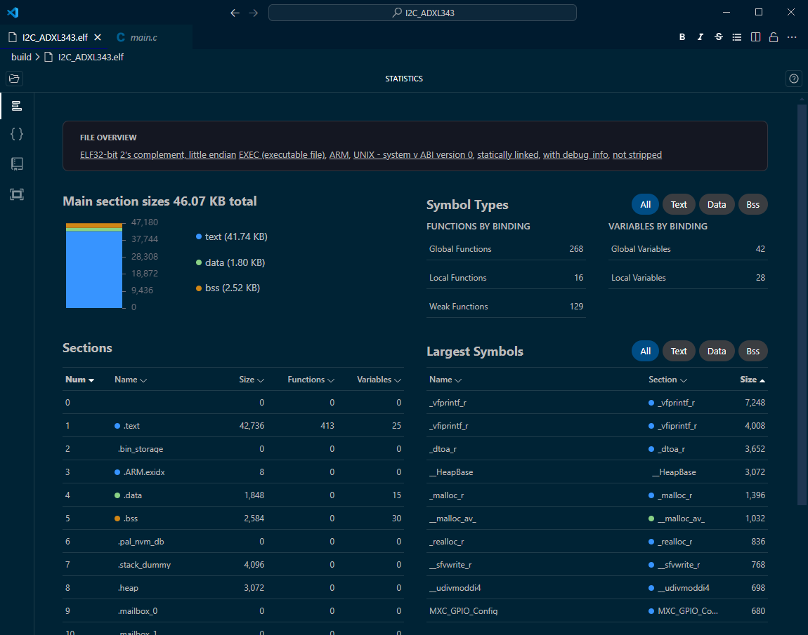

##### Metadata

The Metadata screen displays more detailed data about the ELF file, including info about the target architecture, optimization level, stack usage, AEBI attributes, firmware platform (SDK/Zephyr) and more!

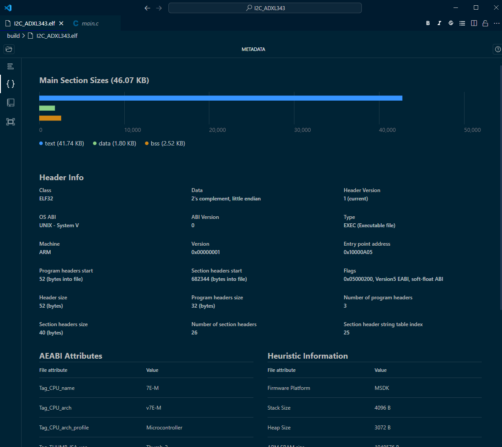

##### Symbol Explorer

This screen allows you to see the full symbol table with address, section, and binding info for all symbols. Even better, all symbols are __searchable__ with SQL-style queries or with a simple name/address search.

##### Navigating to Symbols in Code
If your .elf file contains debug info in DWARF-4 format, an extra `path` column will appear showing the file and line within source code where that symbol is defined. If the source code is on your machine, you can Right-Click that symbol and select `Go to symbol source code` to view the symbol exactly where it's defined.

> [!IMPORTANT]
> Try looking at the `adxl343_config` function in the Symbol Explorer, then navigate to its source code!
>
> You can also try finding the largest symbol in main.c or the adxl343.c driver file!
>
> 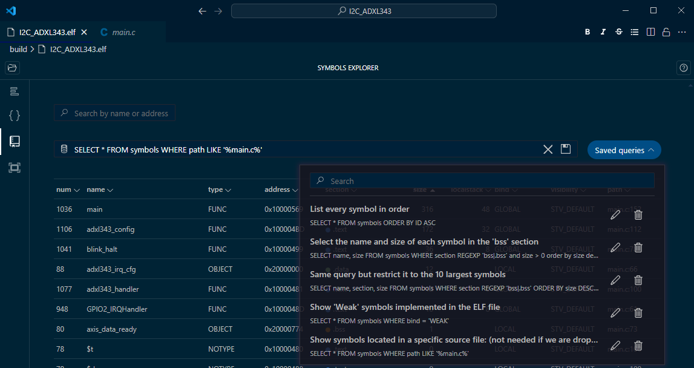
> 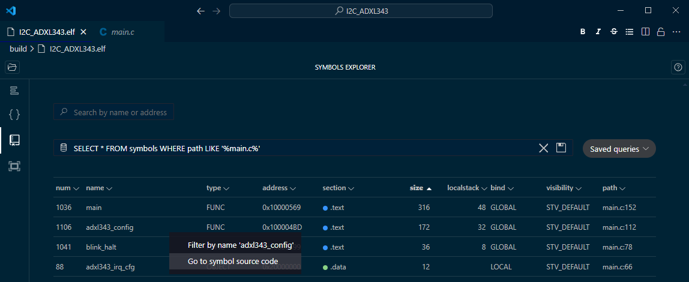

##### Memory Layout

The memory layout screen shows a visual representation of the memory map of a project, including info about the starting address, alignment, size, and permissions (R/W/X) for each region. Best of all, this view is hierarchical, you can click into each region and see its memory sections. Then, you can click into the sections and see details about each memory section!

This type of information can be very useful to examine as the output of a linkerfile or to fully visualize the memory map of an application in important regions.

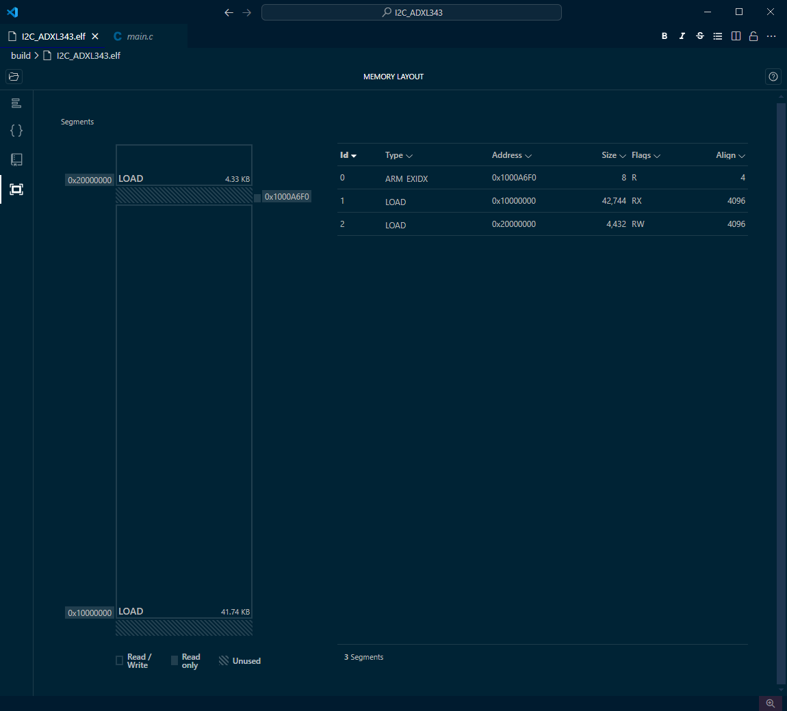

For the MAX32690, FLASH begins at 0x1000_0000 and SRAM begins at 0x2000_0000.

> [!IMPORTANT]
>
> Knowing the information above, try to find the location of the symbol `adxl_irq_cfg` in RAM. Hint: It's somewhere in the .data segment...
> 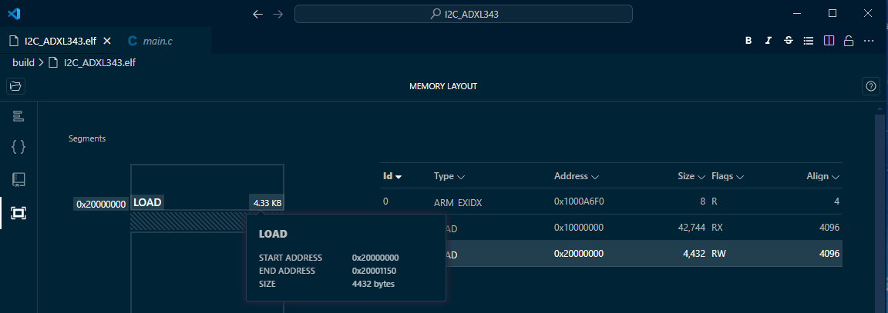
> 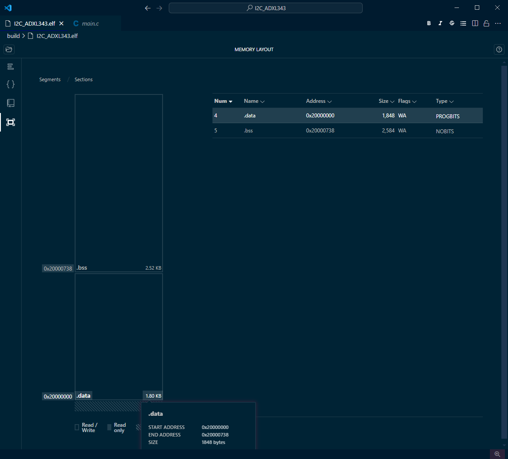


## Mess With the Config Tool

To walk through the Config Tools, we'll go about the task of changing the LED that blinks on the MAX32690FTHR.

> [!IMPORTANT]
>
> Before going into the Config Tool, change the LED_Toggle line at the end of `main()`in `main.c` to a different LED than the one that is currently blinking. The default is red -- try green or blue! Make sure to save main.c before proceeding.
> 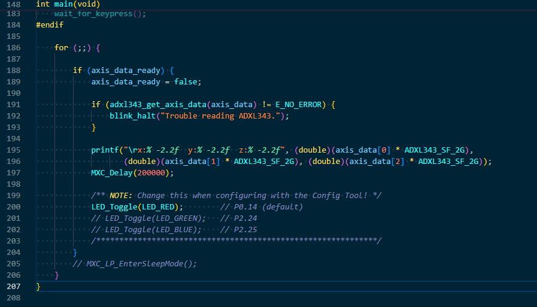
>

CodeFusion Studio (CFS) provides a combined configuration tool to allow easy configuration of pin and clock settings. The Configuration Tool uses CFSCONFIG files which are generated using the New Project wizard. Clicking on the appropriate .cfsconfig file in your project will open the Config Tool.

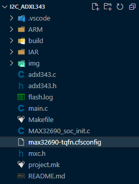

The Config Tool consists of the following tabs.
- Pin Mux
- Function Config
- Clock Config
- Registers

##### Pin Mux

To change the LED, we have to initialize a different GPIO pin as the LED output. We can use the Pin Mux Tool for this.

The Pin Mux Tool displays a map of pins showing the current multiplexing configuration. This will update as peripherals are configured and will show which pins are available, in use, or conflicting. Hovering over a pin will provide a summary of what function the pin is and can be assigned to.

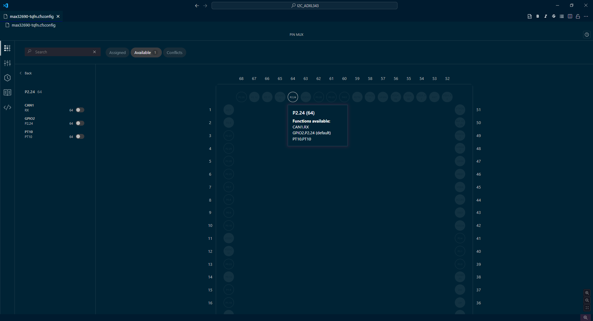

> [!IMPORTANT]
>
> Enable the "GPIOx" function for whichever LED you've selected! The options are:
> - RED - P0.14 (GPIO0)
> - GREEN - P2.24 (GPIO2)
> - BLUE - P2.25 (GPIO2)
> 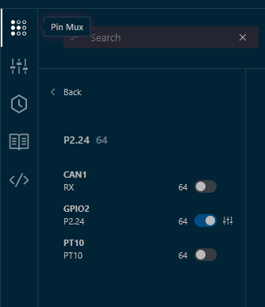

##### Function Config

Displays a list of enabled signals and provides options to adjust the configuration of each. Each option has a default value and can be adjusted with the drop-down menu of allowed options, or a free form text box.

Select the signal name to view the options available.

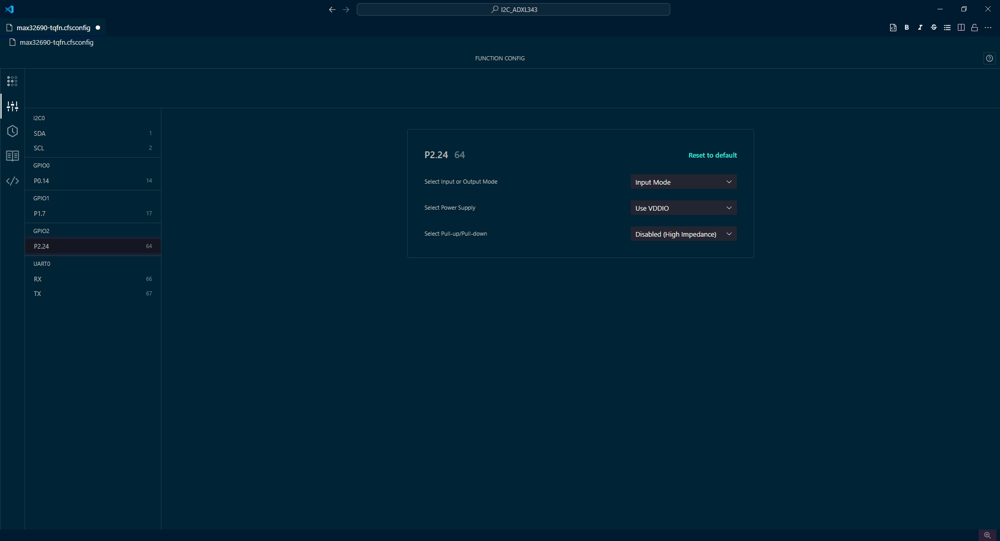

Examples of options:

- Input or output mode
- Power supply
- Pull-up/pull-down

On Zephyr projects, two additional fields are provided under function config:
- Device Tree identifier
- phandle identifier

> [!IMPORTANT]
>
> To configure the pin to work as an LED, change the pin configuration to the following:
> - Output Mode
> - Use VDDIO
> - Drive Strength 0
> 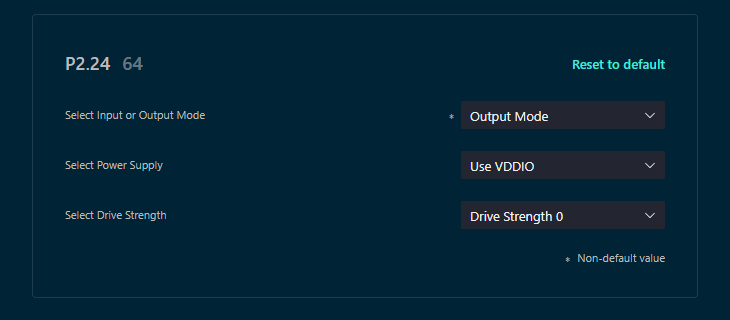

##### Clock Config

This screen allows you configure the clock frequencies that are used by each of the peripherals and cores on the processor. It includes error checking to ensure that the frequencies used are within the constraints of the processor specification. After configuring your clock tree, you can generate code that will set the hardware to the desired clock configuration.

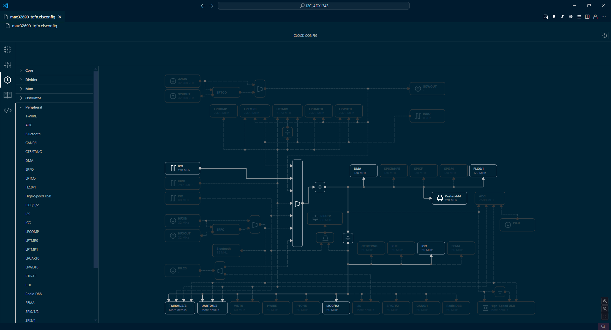

Double-clicking on a multiplexer or peripheral expands the options so that only peripherals in use need to be powered.

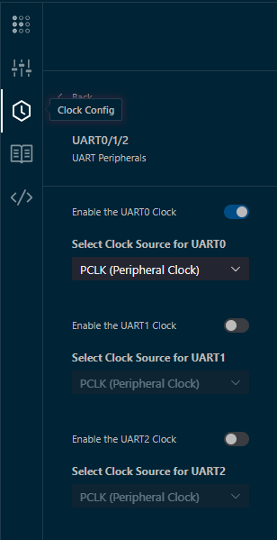

We don't have to do anything in Clock Config to change the LED, but you can play around with this later if you want.

##### Registers

If we had any particular registers we wanted to configure at boot-time, we could do that with the Registers screen. The Registers view displays all registers and corresponding values, including any modified registers marked with an asterisk (*). The search bar provides filters for modified or unmodified registers and allows filtering based on partial register names.

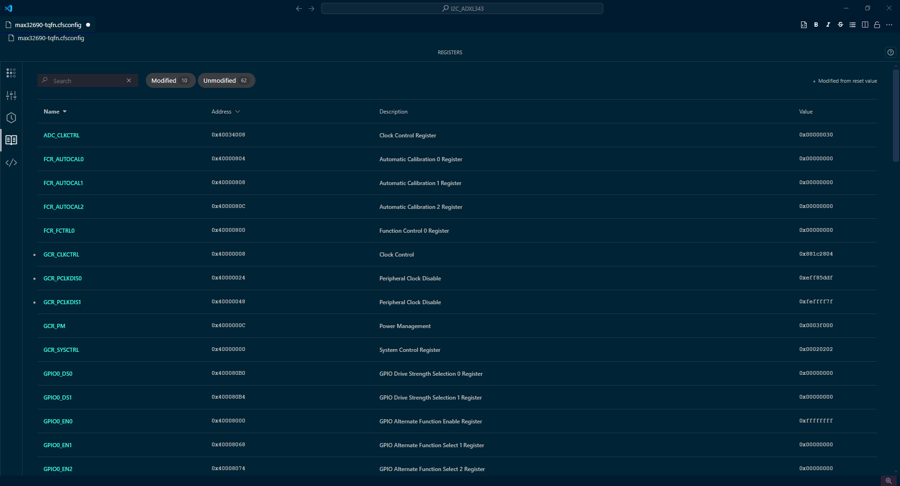

##### Generate Code

Now that we've configured the pin, its functions, and our clocks, it's time to generate our code.

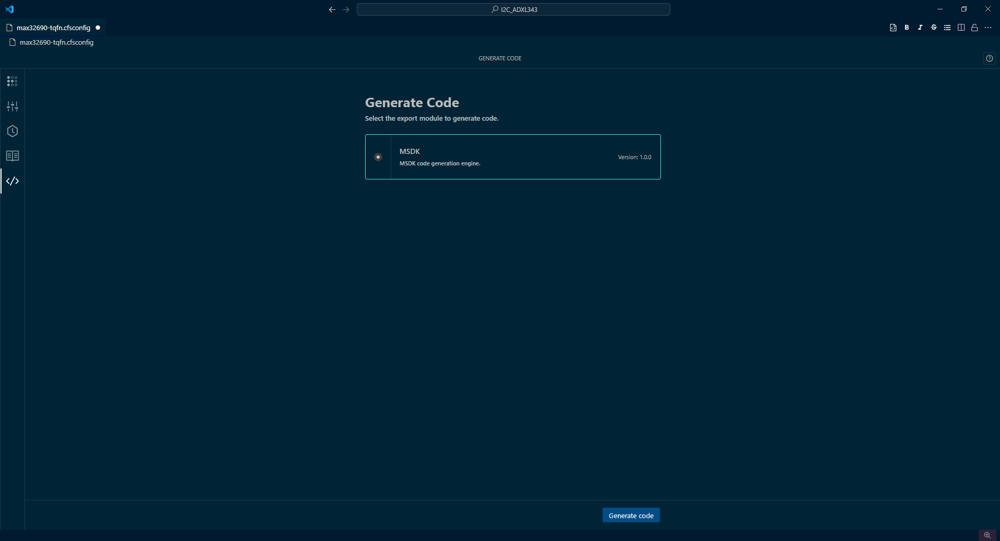

The `Generate code` button will generate a file called `MAX32690_soc_init.c` which contains the configuration from all of the views we went through in the Config Tool. This will include our new LED configuration!

> [!IMPORTANT]
>
> Save this file once it is generated!

##### Build, Flash, Run!

Once the configuration file is generated, we need to rebuild the project.

> [!IMPORTANT]
>
> In the CFS Plugin Menu, under `ACTIONS` select `Build`. This will rebuild our application with the new configuration file.
> 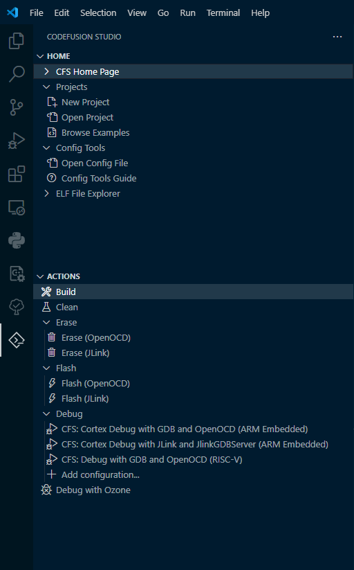
