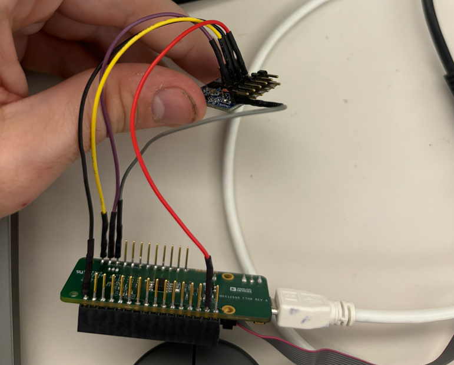

## Description

This application demonstrates I2C communication between the MAX32690 EV Kit and an ADXL343 Digital MEMS Accelerometer.  The application first configures the I2C peripheral instance, probes the I2C bus for the presence of a ADXL343, configures the ADXL343, waits for console input then enters low power mode.  The ADXL343 configured to enable Data Ready interrupts on pin INT2.  The INT2 signal is used as an external interrupt source capable of waking the MAX32690 from sleep mode.  Acceleration data is printed to the console UART on each interrupt.

## Software

### Project Usage

Universal instructions on building, flashing, and debugging this project can be found in the **[MSDK User Guide](https://analogdevicesinc.github.io/msdk/USERGUIDE/)**.

### Project-Specific Build Notes

* This project comes pre-configured for the MAX32690EVKIT.  See [Board Support Packages](https://analogdevicesinc.github.io/msdk/USERGUIDE/#board-support-packages) in the UG for instructions on changing the target board.

## Setup

### Prepare Hardware:
**FTHR**:
- Connect VCC to the FTHR board's 3.3V, and GND to FTHR GND
- Connect I2C SDA to SDA on the bottom of J1
- Connect I2C SCL to the adjact pin to SDA
- Connect INT to to next pin up (INT is on P7 of the Pmod board)



**EVKIT**:
-   Connect INT2 of the ADXL343 to GPIO P2.11 of the MAX32690 EV Kit (header J4.7).
-   Connect SCL of the ADXL343 to GPIO P2.8/I2C0_SCL of the MAX32690 EV Kit (header J4.8).
-   Connect SDA of the ADXL343 to GPIO P2.7/I2C0_SDA of the MAX32690 EV Kit (header J4.9).
-   Connect GND of the ADXL343 to GND of the MAX32690 EV Kit(header J4.1).
-   Connect VIN of the ADXL343 to V_AUX of the MAX32690 EV Kit(header J4.10).

### Required Connections:

-   Connect a USB cable between the PC and the MAX32690 EV Kit CN2 (USB/PWR - UART) connector.
-   Open a terminal application on the PC and connect to the MAX32690 console UART at 115200, 8-N-1.
-   If using the MAX32690FTHR, ensure the I2C_PU jumper is set to use 3.3V.

## Expected Output

The console UART of the MAX32690 EV Kit will output these messages, along with real-time accelerometer data:

```
MAX32690 I2C ADXL343 demo.
Press Enter/Return to continue ...
x:-0.02  y: 0.02  z: 0.99
```
