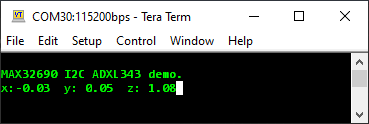

## Description

This application demonstrates I2C communication between the MAX32690 EV Kit and an ADXL343 Digital MEMS Accelerometer.

The application...
- Configures the I2C peripheral instance
- Probes the I2C bus for an ADXL343
- Configures the ADXL343
- Waits for console input
- Enters low power mode

The ADXL343 is configured to enable Data Ready interrupts on pin INT2.  The INT2 signal is used as an external interrupt source capable of waking the MAX32690 from sleep mode.  Acceleration data is printed to the console UART on each interrupt.

#### Required Connections:

Open a terminal application on the PC and connect to the MAX32690 console UART at 115200, 8-N-1 settings. You can use TeraTerm or the VS Code Serial Monitor for this!


#### Expected Output

The console UART of the MAX32690 EV Kit will output these messages, along with real-time accelerometer data:
```
MAX32690 I2C ADXL343 demo.
Press Enter/Return to continue ...
x:-0.02  y: 0.02  z: 0.99
```



#### Hardware Setup

**Components:**

- [Adafruit ADXL343 + ADT7410 Sensor FeatherWing](https://www.adafruit.com/product/4147#:~:text=Upgrade%20any%20Feather%20board%20with%20motion%20and%20precision%20temperature%20sensing)
- [Adafruit FeatherWing Doubler](https://www.digikey.com/en/products/detail/adafruit-industries-llc/2890/5777188?utm_adgroup=&utm_source=google&utm_medium=cpc&utm_campaign=PMax%20Shopping_Product_Low%20ROAS%20Categories&utm_term=&utm_content=&utm_id=go_cmp-20243063506_adg-_ad-__dev-m_ext-_prd-5777188_sig-Cj0KCQjwmOm3BhC8ARIsAOSbapXWc4QrPu9hvkGExHfYoowCYfo_lowEmtW7IHq_iZKP1zqqN4wc5hwaAoHeEALw_wcB&gad_source=1&gbraid=0AAAAADrbLliM7VDd0sPDN1aF2isaVwkF7&gclid=Cj0KCQjwmOm3BhC8ARIsAOSbapXWc4QrPu9hvkGExHfYoowCYfo_lowEmtW7IHq_iZKP1zqqN4wc5hwaAoHeEALw_wcB)
- [MAX32690FTHR Microcontroller Eval Platform](https://www.analog.com/en/products/max32690.html)

```
                                                                              USB
                                                                               │
┌───────────────────────────┐                  ┌───────────────────────────┐   │
│ Sensor FeatherWing        │                  │ MAX32690FTHR              │<──┘
│                           │                  │                           │
│                           │                  │                           │
│                       VDD │<─────────────────┤ +3.3V               P0.14 ├─────>(Red LED)
│                           │                  │                           │
│                           │                  │                     P2.25 ├─────>(Blue LED)
│                           │                  │                           │
│                           │                  │                     P2.24 ├─────>(Green LED)
│               ADXL343_SDA ├──────────────────┤ P2.7 (I2C0_SDA)           │
│                           │                  │                           │                             USB-UART
│               ADXL343_SCL ├──────────────────┤ P2.8 (I2C0_SCL)           │       ┌───────────────────┐    │
│                           │                  │                           │       │  MAX32625PICO     │    │
│              ADXL343_INT2 ├─────────────────>│ P2.11                     │       │  (Debug Adapter)  │<───┘
│                           │                  │                           │       │                   │
│                           │                  │                           │       │                   │
│                           │                  │                           │       │                   │
│                           │                  │                           │       │                   │
│                           │                  │                       SWD ├───────┤                   │
│                           │                  │                           │       │                   │
│                           │                  │                           │       │                   │
│                           │                  │                      UART ├───────┤                   │
│                           │                  │                           │       │                   │
│                           │                  │                           │       │                   │
│                           │                  │                           │       │                   │
│                           │                  │                           │       └───────────────────┘
│                       GND ├──────────────────┤ GND                       │
└───────────────────────────┘                  └───────────────────────────┘
```


## Explore the ELF File

#### Opening the ELF

#### Overview of the Tool

#### Navigating to Symbols in Code

## Mess With the Config Tool

#### Overview of the Tool

#### Changing the LED
