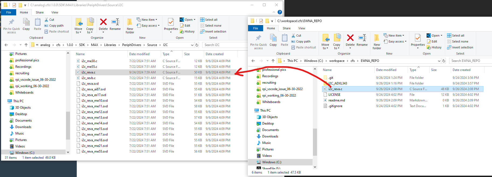
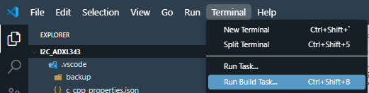
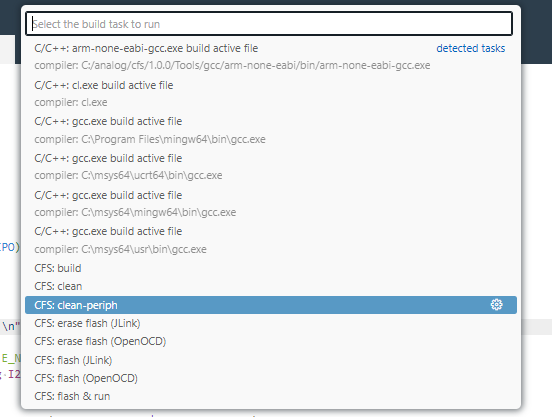

# Repo Instructions

Copy the file `i2c_reva.c` into the MSDK installation of your CodeFusion Studio repository.
The correct path to copy it is `C:\analog\cfs\1.0.0\SDK\MAX\Libraries\PeriphDrivers\Source\I2C`. After that, **you must run the clean-periph task in Code Fusion Studio to re-compile the PeriphDrivers static library.** This can be done by clicking **Terminal->Run Build Task->clean-periph**.

This must be done at the time of writing because MSDK exists in CFS as a static release rather than a git repository, so it is not possible to switch to a specific branch containing the requisite update to the I2C HAL.

At this point, you can build and run using the `Build` and `Flash & Run` tasks, or simply use the buttons for these in the CodeFusion Studio extension. Check the example's README for more details. Instructions for Embedded World NA will be provided in a separate document imminent at the time of writing.
